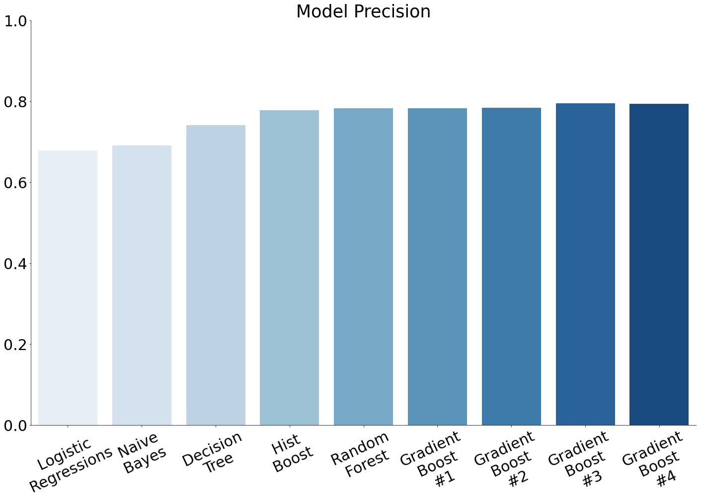
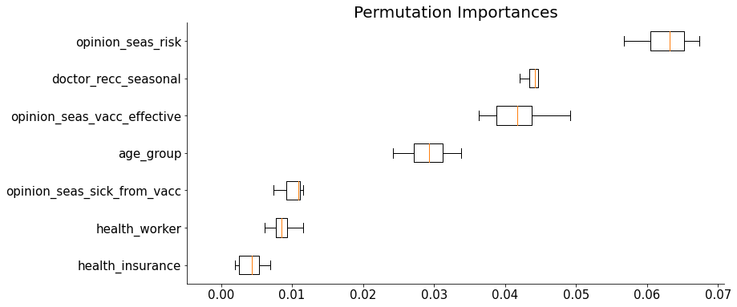
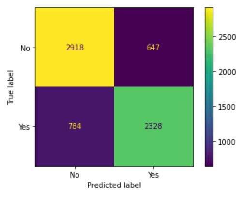

# dsc-phase-3-project


**Authors**: Anthony Warren, Marcelo Scatena, Piotr Czolpik

## Overview

The goal of this project was to build a classifier to predict whether someone was vaccinated against the seasonal flu or not as accurately as possible. Flu season comes around yearly. Every year people either take the flu shot or they do not. We made splits in Age gaps, genders, children in households, etc to see the statistical side of things before we did the modeling. Also we tried to answer some questions such as which subsets of the population should you target when hoping to increase the total number of people receiving the vaccine each year. Or weather to focus more on the female or male audience, or to focus on what age group. 

* Recommendation 1
* Recommendation 2
* Recommendation 3
***

## Business Problem

* Train and run a model that can correctly identify the likelihood that a randomly chosen individual received the seasonal flu vaccine or not
* Find out which characteristics lead people to be more or less prone to have taken the seasonal flu vaccine 
* Use that information to make targeted campaigns to raise vaccine awareness, and see what else could be done do to increase the number of vaccinated people in next campaigns
***

## Data

The information we have is from a 2009 U.S. National H1N1 Flu Survey. The features cover social, economic and demographic background of the participants, as well as opinions on risks of illnes, vaccine effectiveness, and behaviour. The full set of features can be found [here](https://www.drivendata.org/competitions/66/flu-shot-learning/page/211/). It consisted of over 26000 samples with 35 different features.
***

## Methods
 
 * The dataset in question does not contain any continuous variables, making it perfect for classification. There were missing values that were inputed with median values when applicable to prevent information loss, and there were Categorical values in some features, that had to be OneHotEncoded to be part of the data.

* We've constructed simple prediction models using the following methods:
 -- Logistic Regression
 -- K-Nearest Neighbours
 -- Naive Bayes
 -- Decision Trees
 -- Random Forest
 -- Gradient Boost
 -- Hist Gradient Boost
And we have used hyperparameter tuning to improve the last three models in the above list.

***

## Results

* Since the chosen evaluation metric was Precision, we've create a graph recording our progress with the different models:



* The Feature Permutation shows how important each feature was for the model to generate a prediction. Here we selected the seven most important ones to display.



* Below is the Confusion Matrix of our most successful model, the tuned Gradient Boosting Classifier. With it we achieved a Precision of 0.7834 with an Accuracy of 0.7856.



* More graphs?


***

## Conclusions

Given all the information we gathered and visualized, the recommendations we have are:
***
* Recommendation

Explanation

***
* Recommendation

Explanation

***
* Recommendation

Explanation
***

## For More Information

Please review our full analysis in [our Jupyter Notebook](./dsc-phase3-project.ipynb) or our [presentation](./dsc-phase3-presentation.pdf).

For any additional questions, please contact<br />
**Anthony Warren:**<br />
**Marcelo Scatena: marcelo.oddo@gmail.com**<br />
**Piotr Czolpik:**<br />

## Repository Structure


```
├── README.md                           
├── dsc-phase3-project-template.ipynb   
├── DS_Project_Presentation.pdf         
├── data                                
└── images                              
```
